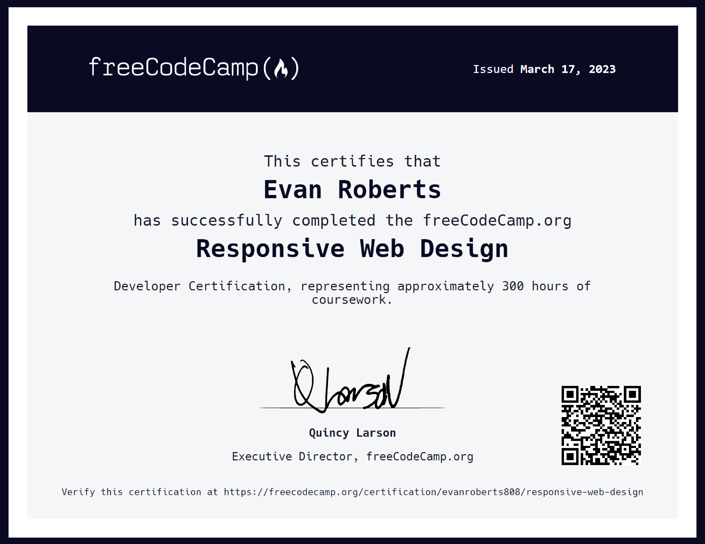

# View Live Projects on CodePen

<h4>Responsive Web Design Projects</h4>
<ul>
    <a href="https://codepen.io/LeosLastWill/pen/BaqBZER"><li>Survey Form</li></a>
    <a href="https://codepen.io/LeosLastWill/pen/yLRBXWE"><li>Tribute Page</li></a>
    <a href="https://codepen.io/LeosLastWill/pen/eYPORwQ"><li>Technical Documentation Page</li></a>
    <a href="https://codepen.io/LeosLastWill/pen/wvYweVq"><li>Product Landing Page</li></a>
    <a href="https://codepen.io/LeosLastWill/pen/oNavevg"><li>Personal Portfolio Webpage</li></a>
</ul>
<h4>JavaScript Algorithms and Data Structures Projects</h4>
<ul>
    <a href="https://codepen.io/LeosLastWill/pen/mdzbMJO"><li>Palindrome Checker</li></a>
    <a href="https://codepen.io/LeosLastWill/pen/VwEZzLe"><li>Roman Numeral Converter</li></a>
    <a href="https://codepen.io/LeosLastWill/pen/rNqBzOR"><li>Caesars Cipher</li></a>
    <a href="https://codepen.io/LeosLastWill/pen/RwebZro"><li>Telephone Number Validator</li></a>
    <a href="https://codepen.io/LeosLastWill/pen/bGmbrEa"><li>Cash Register</li></a>
</ul>
<h4>Front End Development Libraries Projects</h4>
<ul>
<a href="https://codepen.io/LeosLastWill/pen/ZEqzKZK"><li>Random Quote Generator</li></a>
<a href="https://codepen.io/LeosLastWill/pen/poxzGPo"><li>Markdown Previewer</li></a>
<a href="https://codepen.io/LeosLastWill/pen/PoyYvBL"><li>Drum Machine</li></a>
<a href="https://codepen.io/LeosLastWill/pen/MWPWOyJ"><li>Calculator</li></a>
<a href="https://codepen.io/LeosLastWill/pen/poxoOja"><li>25 + 5 Clock</li></a>
</ul>

# Certifications

